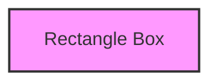
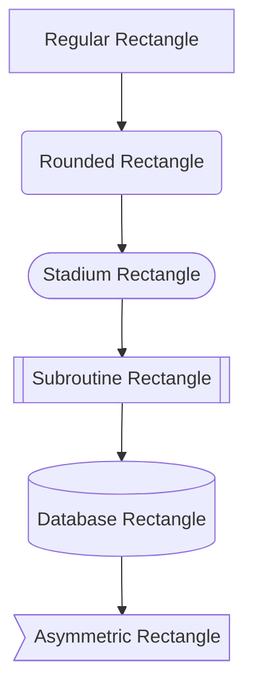

# Mermaid Rectangle Example

```mermaid
flowchart TD
    id1[Rectangle Box]
    
    style id1 fill:#f9f,stroke:#333,stroke-width:2px
```

You can also create other rectangle variations:

```mermaid
flowchart TD
    A[Regular Rectangle]
    B(Rounded Rectangle)
    C([Stadium Rectangle])
    D[[Subroutine Rectangle]]
    E[(Database Rectangle)]
    F>Asymmetric Rectangle]
    
    A --> B --> C --> D --> E --> F
```
